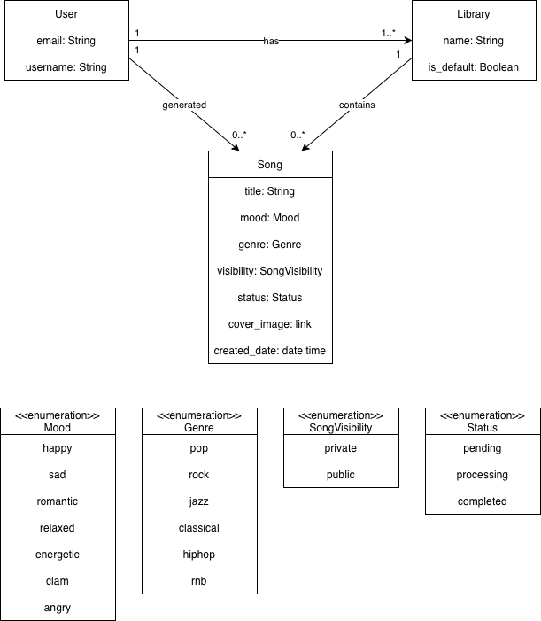
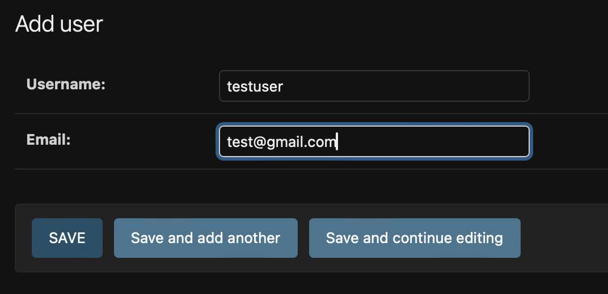
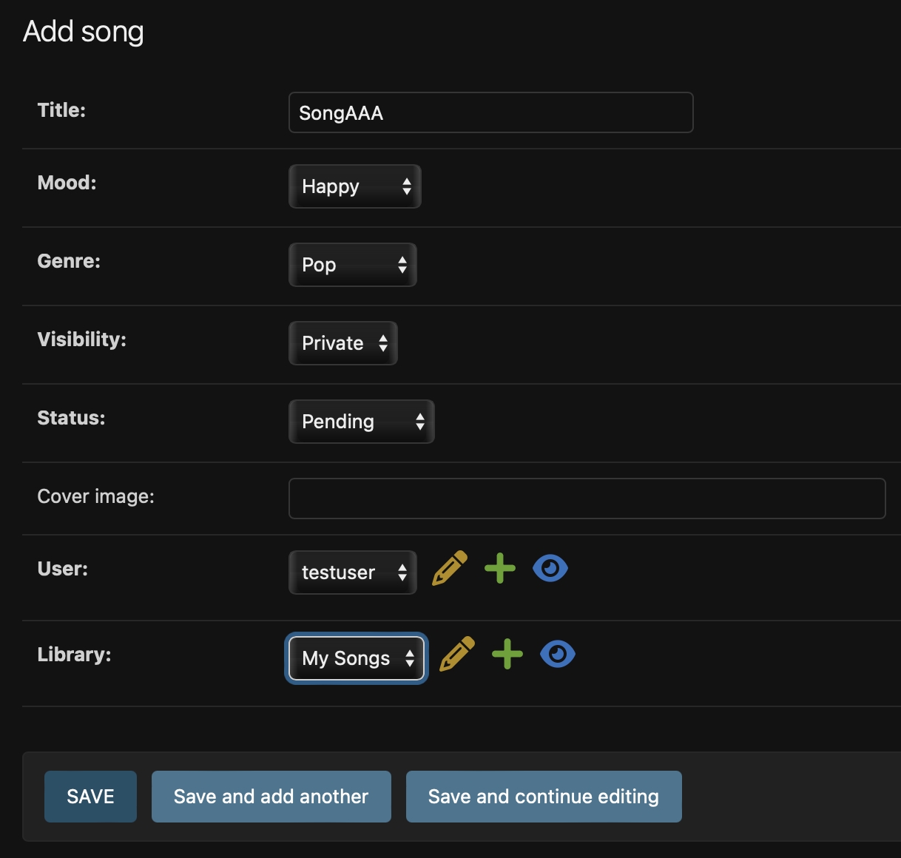
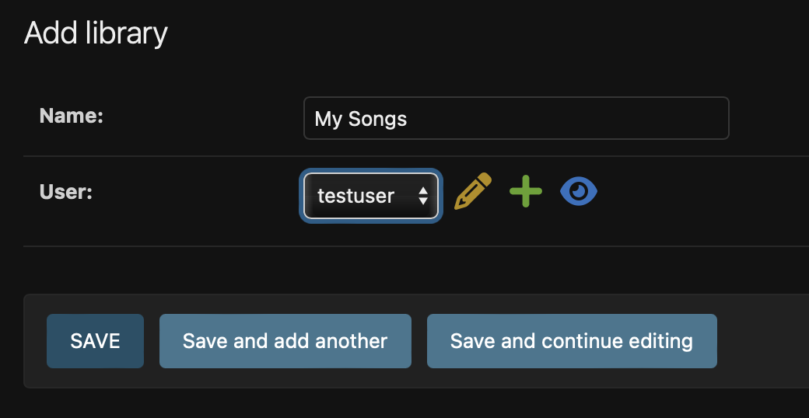
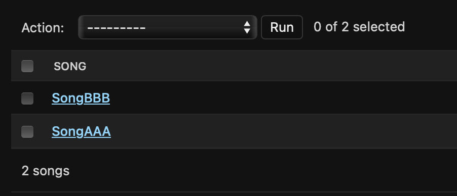
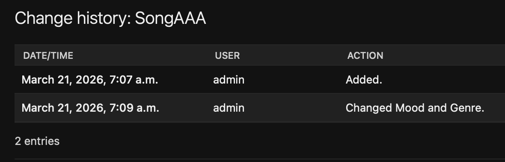
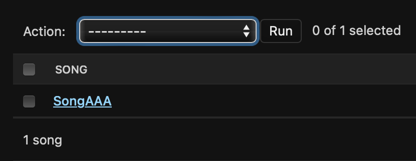

# Django AI Music System

## Project Overview
This project is a Django-based system that models an AI music generation platform. 
The system focuses on the domain layer, including users, songs, and libraries, 
as well as database persistence and CRUD operations.


## Domain Model Diagram



## Domain Model
### Core Domain Entities
- **User**: Represents a user who can create songs and manage libraries.
- **Song**: Represents a generated song.
- **Library**: Represents a collection of songs owned by a user.

### Relationships
- User (1) ——— generates ——> (0..*) Song
- User (1) ——— has ———> (1..*) Library
- Library (1) —— contains ——> (0..*) Song

### Enumerations
- **Mood**: happy, sad, romantic, relaxed, energetic, calm, angry
- **Genre**: pop, rock, jazz, classical, hiphop, r&b
- **SongVisibility**: private, public
- **Status**: pending, processing, completed


## Project Setup
### 1. Clone Repository
```
git clone https://github.com/Chanunchida-Dithakumarn/djangoAIMusic.git
cd djangoAIMusic
```

### 2. Setup Environment
```
python -m venv env

source env/bin/activate   # Mac/Linux
env\Scripts\activate      # Windows
```

### 2. Install Dependencies
```
pip install django
```

### 3. Run Migrations
```
python manage.py makemigrations
python manage.py migrate
```

### 4. Run and Access the admin
```
python manage.py createsuperuser
```
 open your web browser and go to
```
http://127.0.0.1:8000/admin/
```

### 5. Run Server
```
python manage.py runserver
```


## CRUD Functionality
### Create
- Add user



- Add song



- Add library



### Read
- View song list



### Update
- Edit song details



### Delete
- Delete song




## Documents
- [SRS Document](https://docs.google.com/document/d/1jZ_DPozzjafzBFzR-hXG-twCKDTnJYvVNKApg5Cq4FY/edit?tab=t.0)

- [Domain Model Design](https://docs.google.com/document/d/1_vNSHfFB2oyrRuoh96gXLbgVbxj5A7FCda2S8cLuRoM/edit?tab=t.0#heading=h.rj03wl3cevi1)
